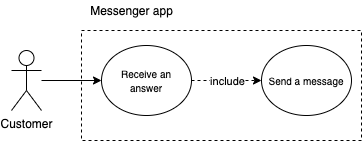
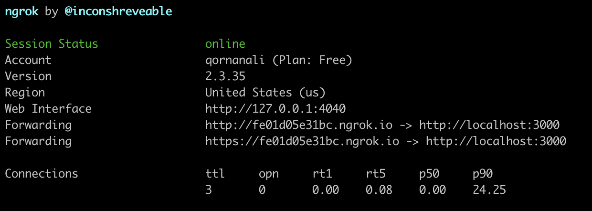
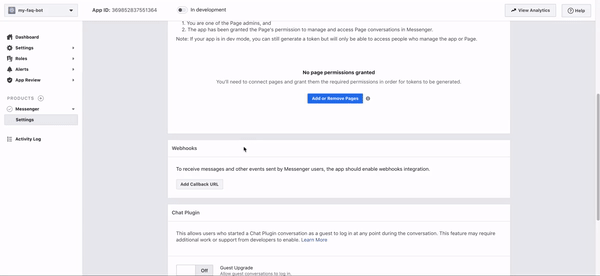
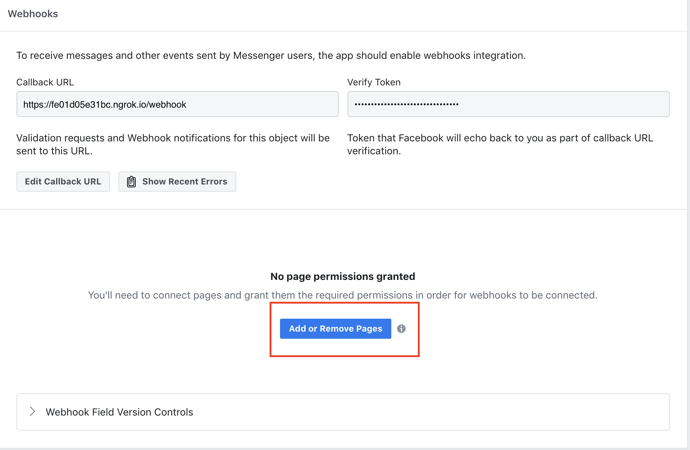
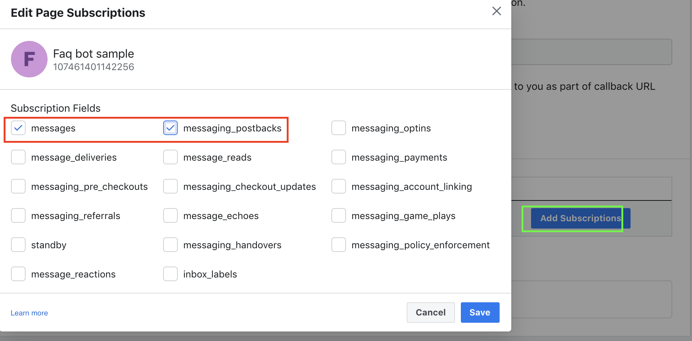
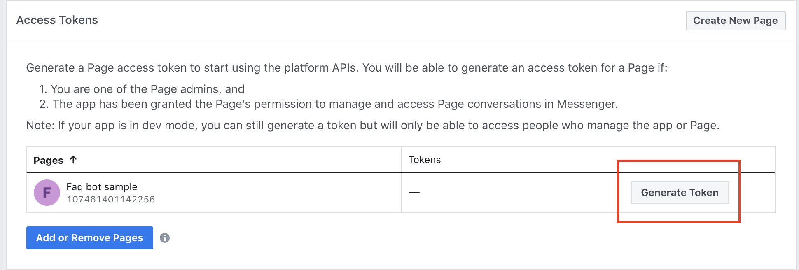
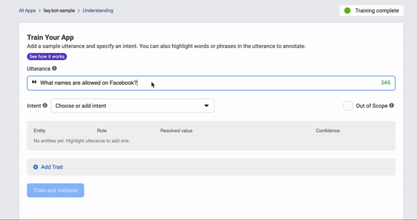
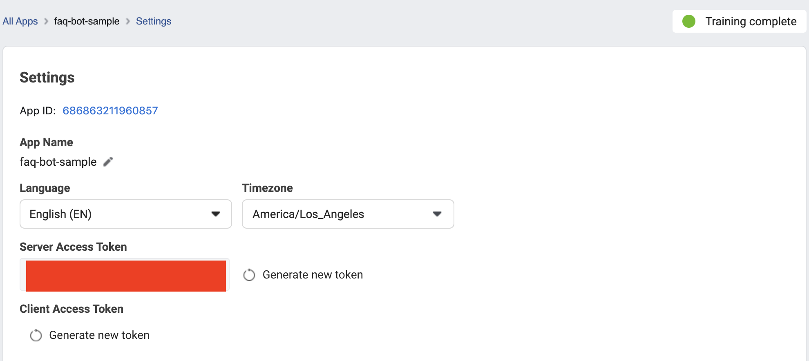
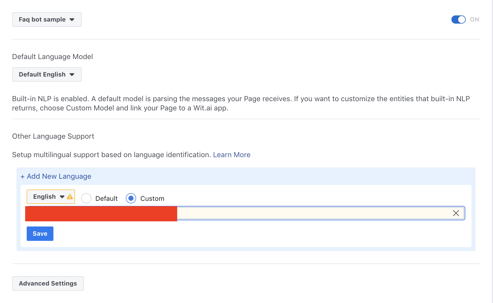
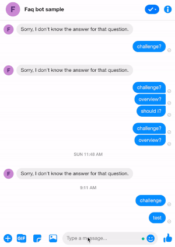

# 🇮🇩 Cara membuat asisten pintar `FAQ-bot` untuk menjawab pertanyaan

## Pengantar 

### Mengapa kita butuh bot ini? 🤔

Ketika kita membuat suatu produk, kita ingin agar pengguna atau customer kita
dapat menggunakannya sesuai dengan yang kita harapkan. Akan tetapi,
seiring dengan berkembangnya produk tersebut, makin banyak
informasi yang tersebar dimana-mana dan membuat customer kita kehilangan arah.

Untuk menyelesaikan itu, disusunlah FAQ. FAQ merupakan singkatan dari
frequently asked question, sebuah list yang berisi pertanyaan-pertanyaan
yang sering diajukan oleh customer ataupun pengguna mengenai sebuah topik, beserta jawabannya.

Untuk meningkatkan kualitas FAQ, kita sebagai produk perlu menjawab hal berikut:

- Apakah jawaban yg diberikan kepada customer sesuai?
- Pertanyaan-pertanyaan apa lagi yang sering ditanyakan customer?

### Lalu apa solusinya? 🙋‍♂️

Seperti yang kita tahu, facebook dengan _messenger-platform_-nya telah merilis API yang
dapat kita gunakan untuk membuat asisten virtual pintar yang dapat
membalas pesan dari user secara otomatis. Tapi jawaban yang biasa saja tidak cukup, karena
ada kemungkinan pertanyaan yang dilontarkan customer itu tidak terdaftar di database kita.
Oleh karena itu kita bisa mengintegrasikan obrolan di bot ini dengan wit.ai
agar di setiap obrolannya, kita bisa mencerna "maksud" dari customer.

Dengan memanfaatkan fitur-fitur tersebut, kita akan membuat suatu bot di messenger
yang dapat mencerna maksud dari pertanyaan yang ditanyakan oleh customer.
Kemudian maksud ini kita olah untuk dapat memberikan jawaban yang sesuai.

## Daftar Isi

* [Pengantar](#pengantar)
  + [Mengapa kita butuh bot ini? 🤔](#mengapa-kita-butuh-bot-ini----)
  + [Lalu apa solusinya? 🙋‍♂️](#lalu-apa-solusinya-------)
* [Daftar Isi](#daftar-isi)
* [Menganalisa aplikasi yang akan kita buat](#menganalisa-aplikasi-yang-akan-kita-buat)
  + [Mendefinisikan ruang lingkup 🔍](#mendefinisikan-ruang-lingkup---)
  + [Mencari tahu teknologi yang dibutuhkan 💻](#mencari-tahu-teknologi-yang-dibutuhkan---)
    - [Membuat messenger app](#membuat-messenger-app)
    - [Melatih AI agar dapat memahami pembicaraan](#melatih-ai-agar-dapat-memahami-pembicaraan)
  + [Kesimpulan 📝](#kesimpulan---)
    - [Facebook melakukan verifikasi webhook](#facebook-melakukan-verifikasi-webhook)
    - [Aplikasi menerima pertanyaan dari customer](#aplikasi-menerima-pertanyaan-dari-customer)
    - [Aplikasi mengirim jawaban ke customer](#aplikasi-mengirim-jawaban-ke-customer)
  + [Prasyarat 📦](#prasyarat---)
* [Saatnya pengembangan aplikasi!](#saatnya-pengembangan-aplikasi-)
  + [Inisialisasi proyek 🧘‍♂️](#inisialisasi-proyek------)
    - [Membuat proyek baru rails](#membuat-proyek-baru-rails)
    - [Menyiapkan database PostgreSQL](#menyiapkan-database-postgresql)
    - [Menjalankan web server](#menjalankan-web-server)
  + [Membuat webhook 🕸](#membuat-webhook---)
    - [Menambahkan `/webhook` ke route](#menambahkan---webhook--ke-route)
    - [Membuat `GET /webhook` untuk verifikasi token](#membuat--get--webhook--untuk-verifikasi-token)
    - [Membuat `POST /webhook` untuk menerima event](#membuat--post--webhook--untuk-menerima-event)
    - [Memeriksa webhook](#memeriksa-webhook)
    - [Mencoba webhook di Facebook app](#mencoba-webhook-di-facebook-app)
  + [Membalas pesan ke customer 💬](#membalas-pesan-ke-customer---)
    - [Mendapatkan akses token dari Facebook page](#mendapatkan-akses-token-dari-facebook-page)
    - [Tambahkan gem Faraday](#tambahkan-gem-faraday)
    - [Modifikasi fungsi create](#modifikasi-fungsi-create)
  + [Mengintegrasikan percakapan dengan AI 🤖](#mengintegrasikan-percakapan-dengan-ai---)
    - [Melatih pemahaman AI pada percakapan](#melatih-pemahaman-ai-pada-percakapan)
    - [Mengubah pengaturan aplikasi di Facebook](#mengubah-pengaturan-aplikasi-di-facebook)
    - [Modifikasi fungsi create](#modifikasi-fungsi-create-1)
  + [Mengirimkan jawaban berdasarkan database](#mengirimkan-jawaban-berdasarkan-database)
    - [Merubah skema database](#merubah-skema-database)
    - [Membuat model Answer](#membuat-model-answer)
    - [Modifikasi fungsi private text_for_answer](#modifikasi-fungsi-private-text-for-answer)
* [Penutup](#penutup)
  + [Apa selanjutnya?](#apa-selanjutnya-)
  + [Referensi](#referensi)

<small><i><a href='http://ecotrust-canada.github.io/markdown-toc/'>Table of contents generated with markdown-toc</a></i></small>

## Menganalisa aplikasi yang akan kita buat

Salah satu kunci membuat aplikasi yang berkualitas bagus adalah dengan mengetahui
selak beluknya. Jika kita mengetahui apa yang kita lakukan, maka dalam proses
pengembangannya akan efektif dan efisien karena kita tahu apa saja spesifikasi teknologi yang dibutuhkan
dan langkah apa yang harus dilakukan jiga terjadi suatu error/bug.

### Mendefinisikan ruang lingkup 🔍

Kita perlu menentukan ruang lingkup agar dalam pengembangan aplikasi ini kita bisa fokus
akan hal-hal yang paling utama. Berikut adalah use case diagramnya:



- Aktor yang bisa berinteraksi dengan sistem adalah: 1) customer.

- Aktor customer dapat melakukan 1) mengirim pesan dan 2) menerima jawaban.

### Mencari tahu teknologi yang dibutuhkan 💻

Agar kita tahu apa saja spesifikasi dari teknologi yang akan kita gunakan,
kita perlu mencoba membuat versi simpel atau bisa kita sebut hello-world dari aplikasi kita.
Metode yang akan kita gunakanan untuk ini ialah _spike_[[2]].

#### Membuat messenger app

Untuk membuat aplikasi di messenger platform yang dapat menerima, membaca lalu membalas pesan,
kita perlu memahami bagaimana arsitektur dari platformnya bekerja.
Untuk memahami caranya, kita bisa langsung masuk ke tutorial singkat
dari messenger-platform di link berikut https://developers.facebook.com/docs/messenger-platform/getting-started.

#### Melatih AI agar dapat memahami pembicaraan

Agar aplikasi kita bisa mencerna "maksud" dari pertanyaan customer, kita perlu mengintegrasikan AI.
AI ini akan kita latih dengan cara memberikan sampel-sampel pertanyaan-pertanyaan dari customer 
lalu kita tentukan dari setiap sampel pertanyaan tersebut, apa "maksud" dari customer.
Untuk memahami caranya, kita bisa langsung masuk ke tutorial singkat
dari wit.ai di link berikut https://wit.ai/docs/quickstart.

### Kesimpulan 📝

Setelah melakukan spike-spike di atas, berikut ini adalah diagram dari spesifikasi
teknologi yang akan kita gunakan. Diagram ini dibuat sesimpel mungkin jadi mungkin
saja ada beberapa informasi yang terlewatkan, tapi ini seharusnya cukup untuk menjelaskan high-levelnya.

Setiap event yang dilakukan oleh customer akan diteruskan ke webhook yang sudah kita buat.
Di webhook inilah aplikasi kamu akan menerima, memproses dan merespon terhadap pesan
yang dikirimkan customer melalui Facebook page.

Kebutuhan dari webhooknya adalah:

- Menunjang protokol HTTPS

- Setifikat SSL yang valid

- Port terbuka yang dapat menerima request `POST` dan `GET`.

#### Facebook melakukan verifikasi webhook


Kita harus menyimpan url webhook yang telah kita siapkan ke pengaturan di Facebook application. 
Saat kita menyimpan, Facebook akan mengirimkan request `GET` yang berisi
proses verifikasi untuk memastikan kebutuhan webhooknya terpenuhi.

#### Aplikasi menerima pertanyaan dari customer


Facebook akan mengirimkan `POST` request ke url webhook yang telah kita simpan di pengaturan.
Request ini berisikan informasi berisi ID dari pengirim pesan, teks pesan, waktu dikirim, dan lain-lain.

#### Aplikasi mengirim jawaban ke customer


Aplikasi kita akan memproses pesan yang diterima sesuai logic yang kita buat.
Selanjutnya aplikasi akan membalas pesan dari pengirim
dengan cara mengirimkan `POST` request ke Facebook Graph API.

### Prasyarat 📦

1. Ruby ~> v2.5

Kamu bisa menggunakan [rbenv](https://github.com/rbenv/rbenv#installing-ruby-versions)
atau [rvm](https://rvm.io/rvm/install#try-out-your-new-rvm-installation),
untuk menginstall versi dari ruby yang dibutuhkan.

Untuk memeriksa apakah perangkatmu sudah terinstall ruby, kamu bisa menjalankan
perintah berikut di terminal/Perintah prompt:

```console
$ ruby -v
# example: ruby 2.5.3p105 (2018-10-18 revision 65156) [x86_64-darwin18]
```

Kalau terminal-mu mengembalikan `ruby <xxx>` maka ruby-mu sudah siap digunakan.

2. Bundler ~> v2

Untuk cara instalasinya, buka terminal/cmd lalu jalankan:

```console
$ gem install bundler -v 2.0.2
```

Untuk memeriksa apakah perangkatmu sudah terinstall bundler, kamu bisa menjalankan
perintah berikut di terminal/Perintah prompt:

```console
$ bundler -v
# example: Bundler version 2.1.4
```

Kalau terminal-mu mengembalikan `Bundler version <xxx>` maka bundler-mu sudah siap digunakan.

3. Rails ~> v6

Untuk cara instalasinya, buka terminal/cmd lalu jalankan:

```console
$ gem install rails -v 6
```

Untuk memeriksa apakah perangkatmu sudah terinstall rails, kamu bisa menjalankan
perintah berikut di terminal/Perintah prompt:

```console
$ rails -v
# example: Rails 6.0.3.4
```

Kalau terminal-mu mengembalikan `Rails <xxx>` maka rails-mu sudah siap digunakan.

4. Docker

Kamu bisa menginstallnya melalui link berikut: https://docs.docker.com/get-docker.

5. Akun developer Facebook

Akun ini diperlukan untuk membuat aplikasi baru, yang merupakan inti dari integrasi Facebook.
Kamu bisa membuat akun baru dengan membuka link berikut: https://developers.facebook.com.

6. Akun wit.ai

Akun ini diperlukan untuk membuat model NLP[[1]], yang digunakan untuk mencerna maksud pertanyaan dari customer.
Kamu bisa membuat akun baru dengan membuka link berikut: https://wit.ai.

7. Akun ngrok

Akun ini diperlukan untuk membuat url https dari webservermu ke internet yang dibutuhkan Facebook
agar bisa mengirimkan data ke webhookmu. Kamu bisa membuat akun baru
dengan membuka link berikut: https://ngrok.com. Jangan lupa untuk mengikuti
panduan setup-nya di https://dashboard.ngrok.com/get-started/setup.

## Saatnya pengembangan aplikasi!

### Inisialisasi proyek 🧘‍♂️

#### Membuat proyek baru rails

Buka terminal/cmd, masuk ke direktori yang kamu inginkan lalu jalankan Perintah di bawah.

```console
$ rails new my-faq-bot --force --api --skip-action-mailbox --skip-action-mailer --skip-active-storage --skip-system-test --skip-action-text --skip-javascript --skip-spring --skip-action-cable --no-skip-active-record --database=postgresql
```

Perintah ini akan membuatkanmu satu folder baru dengan nama `my-faq-bot` yang berisikan
template proyek untuk aplikasi REST API.

#### Menyiapkan database PostgreSQL

Masuk ke direktori proyekmu, lalu buat file baru dengan nama `docker-compose.yml` dengan isi seperti berikut:

```yml
# <root_project_directory>/docker-compose.yml

version: '3'

services:
  postgres:
    image: postgres:11-alpine
    ports:
      - "5432:5432"
    environment:
      - POSTGRES_DB=faq-bot_development
      - POSTGRES_USER=postgres
      - POSTGRES_HOST_AUTH_METHOD=trust
```

Tambahkan key `username` dan `host` di file `config/database.yml` seperti berikut:

```yml
# <root_project_directory>/config/database.yml

development:
  <<: *default
  database: faq-bot_development
  username: postgres
  host: localhost
```

Buka terminal/cmd, lalu jalankan perintah berikut:

```console
$ docker-compose up -d
```

Perintah di atas akan menjalankan satu container PostgreSQL yang akan kita gunakan sebagai database.

#### Menjalankan web server

Masuk ke direktori proyekmu, buka terminal/cmd, lalu jalankan perintah berikut:

```console
$ bin/rails server -port 3000
```

Perintah di atas akan menjalankan proyekmu sebagai webserver di port 3000. 
Selanjutnya buka `http://localhost:3000` di browsermu dan pastikan kamu melihat halaman: "Yay! You’re on Rails!"

### Membuat webhook 🕸

#### Menambahkan `/webhook` ke route

Masuk ke direktori proyekmu, lalu tambahkan resource `webhook` di `config/routes.rb`.

```ruby
# <root_project_directory>/config/routes.rb

Rails.application.routes.draw do
  resource :webhook, only: [:show, :create]
end
```

Untuk melihat apakah url kita bekerja, buka terminal/cmd, lalu jalankan perintah berikut:

```console
$ bin/rails routes

#  Prefix Verb URI Pattern        Controller#Action
# webhook GET  /webhook(.:format) webhooks#show
#         POST /webhook(.:format) webhooks#create
```

Dari contoh hasilnya seperti di atas, maka:

- jika ada request `GET /webhook` seharusnya akan di-route ke `WebhooksController` pada fungsi `#show`.

- jika ada request `POST /webhook` seharusnya akan di-route ke `WebhooksController` pada fungsi `#create`.

#### Membuat `GET /webhook` untuk verifikasi token

Masuk ke direktori proyekmu, lalu buat file baru `webhooks_controller.rb` di `app/controllers/`.

```ruby
# <root_project_directory>/app/controllers/webhooks_controller.rb

class WebhooksController < ApplicationController
  def show
    mode = params['hub.mode']
    token = params['hub.verify_token']
    challenge = params['hub.challenge']

    if mode == 'subscribe' && token == 'foo'
      print 'WEBHOOK_VERIFIED'
      render json: challenge, status: :ok
      return
    end

    render json: 'FAILED', status: :forbidden
  end
end
```

#### Membuat `POST /webhook` untuk menerima event

Masuk ke direktori proyekmu, lalu tambahkan fungsi `#create` di `WebhooksController`.

```ruby
# <root_project_directory>/app/controllers/webhooks_controller.rb

class WebhooksController < ApplicationController
  # show ..

  def create
    webhook_data = params['webhook'].as_json
    if webhook_data['object'] != 'page'
      render json: 'FAILED', status: :not_found
      return
    end

    entries = webhook_data['entry']
    entries.each do |entry|
      messaging = entry['messaging'].first
      print messaging['message']
    end
    render json: 'EVENT_RECEIVED', status: :ok
  end
end
```

#### Memeriksa webhook

Untuk memeriksa apakah webhook kita sudah berhasil, buka terminal/cmd,
lalu [jalankan web server](#menjalankan-web-server),
kemudian jalankan perintah berikut untuk verifikasi token:

```console
$ curl -X GET "localhost:3000/webhook?hub.verify_token=foo&hub.challenge=CHALLENGE_ACCEPTED&hub.mode=subscribe"
```

Kita bisa tahu webhook kita sukses adalah dengan melihat:

- Jika isi dari parameter query `hub.verify_token` sama dengan token yang sudah kita tentukan di atas,
maka ekspektasinya webhook harus mengembalikan isi
dari parameter query `hub.challenge` dan statusnya `200 ok`.

- Ada pesan `WEBHOOK_VERIFIED` yang tampil di console.

Untuk event di webhook, jalankan perintah berikut:

```console
$ curl -H "Content-Type: application/json" -X POST "localhost:3000/webhook" -d '{"object": "page", "entry": [{"messaging": [{"message": "TEST_MESSAGE"}]}]}'
```

Kita bisa tahu webhook kita sukses adalah dengan melihat:

- Jika isi dari request body `object` adalah `page` maka ekspektasinya webhook
harus mengembalikan `EVENT_RECEIVED` dan statusnya `200 ok`.

- Ada pesan `TEST_MESSAGE` yang tampil di console.

#### Mencoba webhook di Facebook app

Seperti yang sudah dijabarkan di [kesimpulan](#kesimpulan), ada beberapa kebutuhan yang perlu
dipenuhi agar webhook kita bisa disimpan di konfigurasi aplikasi. Untuk sementara ini karena
kita masih dalam tahap pengembangan, kita bisa menggunakan software bernama ngrok.
Langkah-langkanya:

**1. Ubah konfigurasi aplikasi**

Masuk ke direktori proyekmu, lalu perbolehkan hostname ngrok di `config/environments/development.rb`
dengan cara menambahkan `config.hosts << /[a-z0-9]+\.ngrok\.io/` seperti di bawah:

```ruby
# <root_project_directory>/config/environments/development.rb

Rails.application.configure do
  # configs ..

  config.hosts << /[a-z0-9]+\.ngrok\.io/
end
```

**2. Jalankan web server**

Lakukan seperti [tahap ini](#menjalankan-web-server).

**3. Jalankan ngrok**

Buka tab baru di terminal/cmd, lalu jalankan perintah:

```console
$ ngrok http 3000
```

Contoh keluaran:



Ambil https url dari baris `Forwarding` misalnya `https://fe01d05e31bc.ngrok.io`

**4. Simpan webhook url di konfigurasi facebook app**

Jika kamu mengikuti [bagian ini](#membuat-messenger-app), maka kamu seharusnya sudah memiliki
akun developer Facebook dan pernah membuat aplikasi Facebook. Langkah selanjutnya adalah:

1. Buka laman pengaturan dari aplikasi Facebook yang pernah kamu buat.

2. Masuk ke bagian `messenger > settings > webhooks`



Tambahkan host dan verifikasi token sesuai dengan form di gambar. Contohnya, url webhook adalah `https://fe01d05e31bc.ngrok.io/webhook` dan verifikasi tokennya adalah `foo`.

3. Hubungkan bot dengan page Facebook





Tambahkan `messages` dan `messaging_postback` sebagai pengaturan subscription.

4. Periksa apakah konfigurasi sudah benar seperti di [bagian ini](#memeriksa-webhook)
dengan mengirimkan pesan ke page Facebook yang sudah kamu pilih.

### Membalas pesan ke customer 💬

#### Mendapatkan akses token dari Facebook page

1. Buka laman pengaturan dari aplikasi Facebook yang pernah kamu buat.

2. Masuk ke bagian `messenger > settings > webhooks`



3. Dapatkan token dari bagian `access tokens`

> :warning: Berhati-hatilah dengan token ini. Jangan bagikan ke siapapun kecuali kamu mempercayainya.

#### Tambahkan gem Faraday

Faraday adalah salah satu gem yang berfungsi sebagai HTTP client.
Masuk ke direktori proyekmu, lalu tambahkan Faraday `Gemfile`:

```ruby
# <root_project_directory>/Gemfile

gem 'faraday'
```

Buka terminal/cmd, lalu jalankan perintah:

```console
$ bundle install
```

#### Modifikasi fungsi create

Masuk ke direktori proyekmu, lalu modifikasi fungsi `#create` di `WebhooksController`.

```ruby
# <root_project_directory>/app/controllers/webhooks_controller.rb

class WebhooksController < ApplicationController
  # show ..

  def create
    webhook_data = params['webhook'].as_json
    if webhook_data['object'] != 'page'
      render json: 'FAILED', status: 404
      return
    end

    entries = webhook_data['entry']
    entries.each do |entry|
      messaging = entry['messaging'].first
      message = messaging['message']
      sender_id = messaging['sender']['id']
      text_for_answer = message['text']
      send_message(sender_id, text_for_answer)
    end
    render json: 'EVENT_RECEIVED', status: 200
  end

  private

    def send_message(recipient_id, text)
      access_token = '<put your page access token>'
      request_url = URI("https://graph.facebook.com/v2.6/me/messages?access_token=#{access_token}")
      request_body = {
        recipient: {
          id: recipient_id
        },
        message: {
          text: text
        }
      }.to_json

      resp = Faraday.post(request_url, request_body, "Content-Type" => "application/json")
    end
end
```

Setelah itu kamu bisa mencobanya dengan mengirimkan pesan ke Facebook pagemu.
Jangan lupa untuk memastikan [bagian ini](#mencoba-webhook-di-facebook-app) sudah kamu lakukan
dan web server sedang berjalan.

### Mengintegrasikan percakapan dengan AI 🤖

#### Melatih pemahaman AI pada percakapan

Untuk dapat mencerna "maksud" dari pertanyaan customer, kita bisa melatih aplikasi kita agar
dapat mengekstrak "maksud" dari kalimat tersebut berdasarkan seberapa tinggi tingkat kebenarannya.

Jika sebelumnya kamu pernah melakukan [bagian ini](#melatih-ai-agar-dapat-memahami-pembicaraan),
maka seharusnya tidak jauh berbeda caranya.
Pertama-tama, kita buat aplikasi di wit.ai. Lalu masuk ke halaman understanding.



Kemudian masukkan utterances, pilih entity dan intentnya. Semakin banyak sample utterance yang
dipakai untuk proses latihan ini, maka kualitas dari tingkat kebenarannya akan semakin baik.

#### Mengubah pengaturan aplikasi di Facebook

1. Ambil access token dari akun wit.ai



> :warning: Berhati-hatilah dengan token ini. Jangan bagikan ke siapapun kecuali kamu mempercayainya.

2. Buka laman pengaturan dari aplikasi Facebook yang pernah kamu buat.

3. Masuk ke bagian `messenger > settings > Built-In NLP`

4. Pilih `Other Language Support`, kemudian pilih `English`, lalu pilih `Custom`.
Kemudian masukkan access token yang kita dapatkan dari wit.ai



#### Modifikasi fungsi create

Masuk ke direktori proyekmu, lalu modifikasi fungsi `#create` di `WebhooksController`.

```ruby
# <root_project_directory>/app/controllers/webhooks_controller.rb

class WebhooksController < ApplicationController
  # show ..

  def create
    webhook_data = params['webhook'].as_json
    if webhook_data['object'] != 'page'
      render json: 'FAILED', status: 404
      return
    end

    entries = webhook_data['entry']
    entries.each do |entry|
      messaging = entry['messaging'].first
      message = messaging['message']
      sender_id = messaging['sender']['id']
      send_message(sender_id, text_for_answer(message))
    end
    render json: 'EVENT_RECEIVED', status: 200
  end

  private

    # send_message ...

    def text_for_answer(message)
      selected_intents = message['nlp']['intents'].select { |item| item['confidence'].to_f > 0.5 }
      sorted_intents = selected_intents.sort_by { |item| -item['confidence'].to_f }
      intent = sorted_intents.first['name'] unless sorted_intents.empty?
      return 'You can put anyname on Facebook' if intent == 'allowed_name'

      message['text']
    end
end
```

Setelah itu kamu bisa mencobanya dengan mengirimkan pesan ke Facebook pagemu.
Jangan lupa untuk memastikan [bagian ini](#mencoba-webhook-di-facebook-app) sudah kamu lakukan
dan web server sedang berjalan.

### Mengirimkan jawaban berdasarkan database

#### Merubah skema database

Buka terminal/cmd, masuk ke direktori yang kamu inginkan lalu jalankan Perintah di bawah.

```console
$ bin/rails generate migration CreateAnswers

# invoke  active_record
# create  db/migrate/20201025103252_create_answers.rb
```

Perintah ini akan menghasilkan file baru berisikan template script untuk mengubah skema pada database.

Selanjutnya masuk ke file baru yang telah digenerate tersebut misalnya `db/migrate/20201025103252_create_answers.rb`.
Kemudian tambahkan isinya menjadi seperti berikut:

```ruby
# <root_project_directory>/db/migrate/20201025103252_create_answers.rb

class CreateAnswers < ActiveRecord::Migration[6.0]
  def change
    create_table :answers do |t|
      t.string :question_type, null: false
      t.string :text, null: false

      t.timestamps
    end

    add_index :answers, :question_type, unique: true
  end
end
```

Isi dari script ini adalah, kita akan menambahkan tabel baru bernama `answers` yang memiliki
kolom `question_type` dengan tipe `string`, dan `text` dengan tipe `string`.

Kembali ke terminal/cmd, jalankan perintah:

```console
$ docker-compose up -d
$ bin/rails db:migrate
```

Perintah ini akan menjalankan container berisikan PostgreSQL yang telah kita persiapkan
di [bagian ini](#menyiapkan-database-postgresql). Selanjutnya, kita mengeksekusi script migration
untuk menerapkan skema database baru yang telah kita rancang.

#### Membuat model Answer

Masuk ke direktori proyekmu, lalu buat file baru `answer.rb` di `app/models/`.

```ruby
# <root_project_directory>/app/models/answer.rb

class Answer < ApplicationRecord
  validates :question_type, uniqueness: true
end
```

**Menambahkan record pada table answers**

Buka terminal/cmd, masuk ke direktori yang kamu inginkan lalu jalankan Perintah di bawah.

```console
$ bin/rails console

irb(main):001:0> Answer.create(question_type: 'allowed_name', text: 'You can put anyname on Facebook')
```

#### Modifikasi fungsi private text_for_answer

Masuk ke direktori proyekmu, lalu modifikasi fungsi private `#text_for_answer` di `WebhooksController`.

```ruby
# <root_project_directory>/app/controllers/webhooks_controller.rb

class WebhooksController < ApplicationController
  # show ..

  # create ..

  private

    # send_message ...

    def text_for_answer(message)
      selected_intents = message['nlp']['intents'].select { |item| item['confidence'].to_f > 0.5 }
      sorted_intents = selected_intents.sort_by { |item| -item['confidence'].to_f }
      intent = sorted_intents.first['name'] unless sorted_intents.empty?
      answer = Answer.find_by_question_type(intent)
      return answer.text if answer.present?

      message['text']
    end
end
```

Setelah itu kamu bisa mencobanya dengan mengirimkan pesan ke Facebook pagemu.
Jangan lupa untuk memastikan [bagian ini](#mencoba-webhook-di-facebook-app) sudah kamu lakukan
dan web server sedang berjalan.

## Penutup



Selamat! teman-teman sudah berhasil membuat FAQ-bot menggunakan messenger dan wit.ai.
Di tulisan kali ini kita sudah belajar banyak hal seperti persiapan
sebelum pengembangan, bagaimana cara membuat messenger app, bagaimana cara kerja NLP, dll.
Semoga apa yang sudah dipelajari dapat bermanfaat dan
bisa dikembangkan menjadi hal yang lebih keren lagi! 😁

Kode seluruh proyek ini dapat diakses di https://github.com/qornanali/faq-bot.

### Apa selanjutnya?

Tentu aplikasi ini belum sempurna. Ke depannya kamu bisa menambahkan:

1. Karena ngrok memiliki keterbatasan dan sifatnya sementara untuk proses development,
oleh karena kita perlu deploy aplikasi di server pilihanmu agar aplikasinya selalu melayani
pertanyaan customer. Kamu bisa menggunakan Heroku, Azure, AWS, dll.

2. Saat ini untuk menambahkan record di table answers, kita masih menggunakan rails console.
Jika kita menyediakan API CRUD (create, read, update, delete) yang bisa dikonsumsi internal,
maka prosesnya akan lebih mudah.

*Apakah ada yang lainnya?*

Tentu saja. Kamu bisa berkontribusi ke repository ini dengan
mengikuti [issues](https://github.com/qornanali/faq-bot/issues) di repository ini.
Kontribusi dalam bentuk apapun akan diterima! 😁

### Referensi

- https://developers.facebook.com/docs/messenger-platform

- https://guides.rubyonrails.org/

- https://wit.ai/docs

- https://ngrok.com/docs

- https://developercircles2020.devpost.com/details/resources

[1]: https://id.wikipedia.org/wiki/Pemrograman_neurolinguistik

[2]: https://en.wikipedia.org/wiki/Spike_(software_development)
